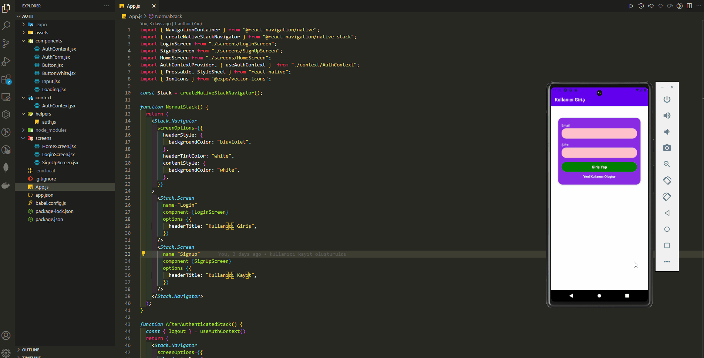
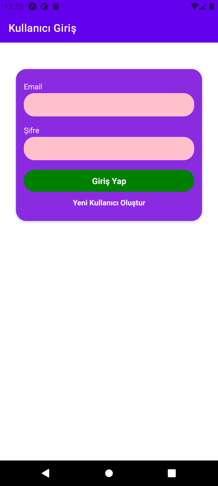
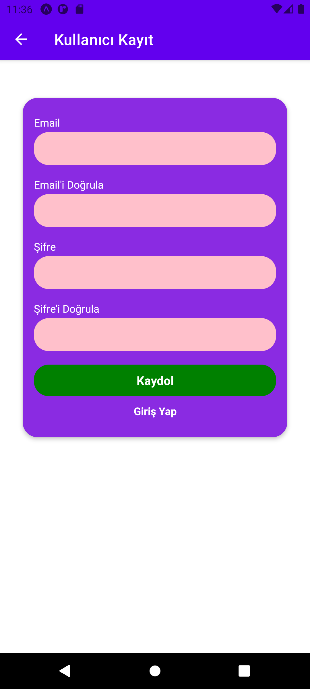
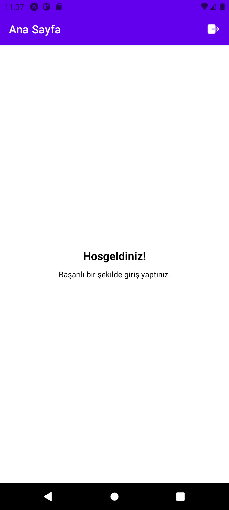

# React Native Authentication Project

<div align="center">
  
</div>

## About the Project

This project is a basic user authentication system built with React Native. Users can sign up, log in, and log out. The app handles authentication states and navigation based on the user's authentication status.

## Table of Contents

- [Features](#features)
- [Technologies Used](#technologies-used)
- [Usage](#usage)
- [Project Skeleton](#project-skeleton)
- [Screenshots](#screenshots)

## Features
- User registration and login system.
- Authentication using JSON Web Tokens (JWT).
- Navigation between screens and logout functionality.
- Displays "Home Screen" after successful login.
- Persistent authentication state using local storage.

## Technologies Used

- `@react-native-async-storage/async-storage`: AsyncStorage module.
- `@react-navigation/native and @react-navigation/native-stack`: React Navigation library.
- `axios`: HTTP client.
- `expo`: Expo SDK.
- `react`: React library.
- `react-native`: React Native framework.
- `react-native-safe-area-context and react-native-screens`: React Native helper libraries.

## Usage

### Sign Up:

- Open the app and navigate to the "Sign Up" screen.
- Enter your email and password to create a new account.
- Click the "Sign Up" button. If the registration is successful, you will be automatically logged in and redirected to the Home screen.

### Login:

- If you already have an account, navigate to the "Login" screen.
- Enter your email and password.
- Click the "Login" button. Upon successful authentication, you will be redirected to the Home screen.

### Logout:

- After logging in, you can log out by pressing the "Logout" button in the Home screen’s header.

### Persistent Authentication

- The app stores the authentication token in AsyncStorage to maintain the user's session even after the app is closed and reopened.
- Upon launching, the app checks for a stored token and updates the authentication state accordingly.

## Project Skeleton

```
React Native Authentication Project (folder)
│
├── assets
│     └── [images]
├── components
│     ├── AuthContent.jsx 
│     ├── AuthForm.jsx 
│     ├── Button.jsx 
│     ├── ButtonWhite.jsx 
│     ├── Input.jsx       
│     └── Loading.jsx 
├── context      
│     └── AuthContext.jsx 
├── helpers      
│     └── auth.js
├── screens
│     ├── HomeScreen.jsx 
│     ├── LoginScreen.jsx      
│     └── SignUpScreen.jsx 
├── .gitignore
├── App.js
├── app.json
├── babel.config.js
├── package-lock.json
├── package.json
└── README.md
```

## Screenshots

<div align="center">
  
  
  
</div>